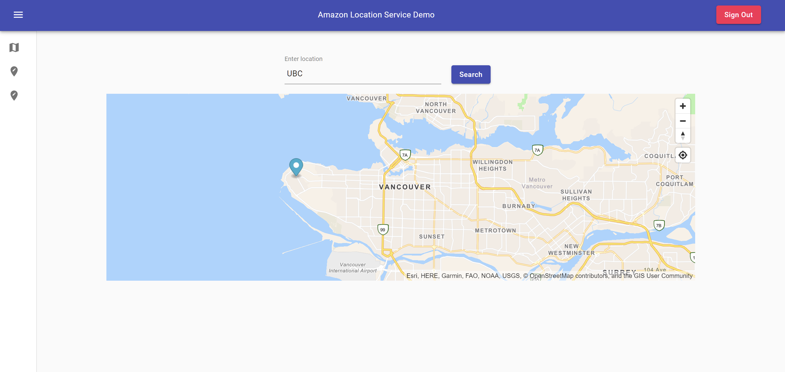
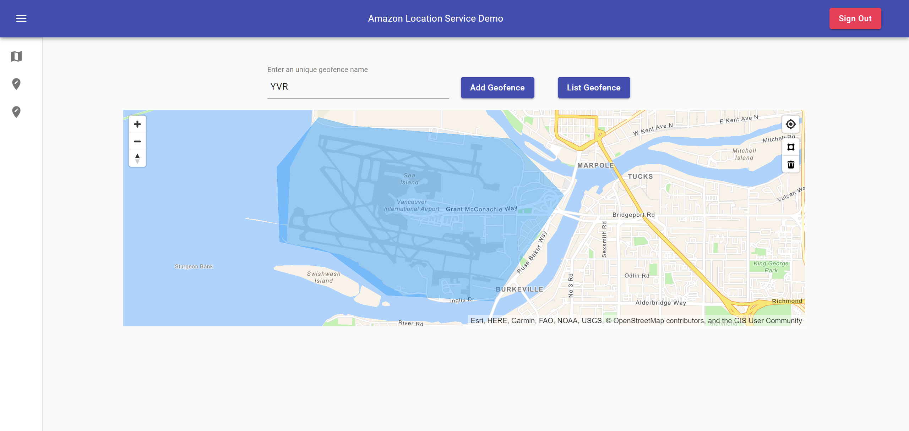
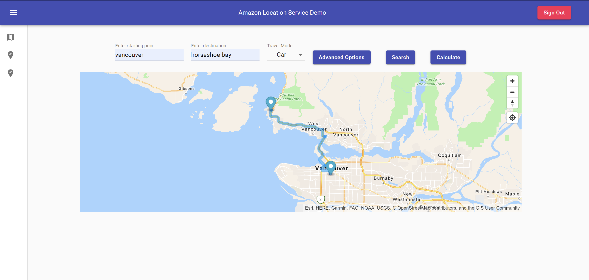
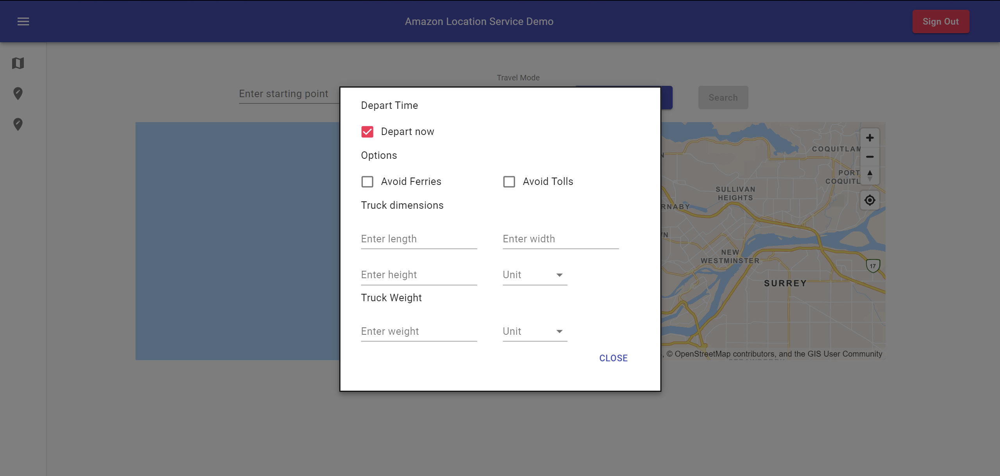

# Amazon Location Service Demo -- React JS

## Project Overview
This project provides a deployable demo that showcases most features for [Amazon Location Service](https://aws.amazon.com/location).

###Features showcased in this app
- Maps (Visualize location information)
- Places (Geocoding/Reverse Geocoding)
- Routes (Calculate routes with different transportation and departure time options)
- Geofence (Create, list, delete geofence)

See all features available on Location Service [Here](https://aws.amazon.com/location/features/)

###Simple Architecture Overview
The users sign up using a secured login through [Amazon Cognito](https://aws.amazon.com/cognito/) into a [ReactJS](https://reactjs.org/)
Web Application hosted via [AWS Amplify](https://aws.amazon.com/amplify/).

Temporary credentials will be generated by the Cognito User Pool after the user signed in, the App uses the credentials
to access Amazon Location Service via [AWS Javascript SDK](https://docs.aws.amazon.com/AWSJavaScriptSDK/latest/AWS/Location.html).

## Table of Contents

|Index| Description|
|:----------------|:-----------|
| [Application Screenshots](#application-screenshots)         |    Check out the application's user interface. |
| [Deployment](#deployment)         |    Learn how to deploy this project yourself. |
| [Credits](#credits)         |    Meet the team behind this |
| [License](#license)      |     License details.     |

## Application Screenshots

<h6 align="center">Application Home Page</h6>

<h6 align="center">Geofence Page</h6>

<h6 align="center">Route calculation for navigation</h6>

<h6 align="center">Options for truck navigation</h6>

## Deployment
To deploy this solution into your AWS Account please follow our [Deployment Guide](docs/DeploymentGuide.md)

## Credits
This demo was developed by Edward Chen, with guidance from the [UBC CIC](https://cic.ubc.ca/)
technical teams.

## License
This project is distributed under the [MIT License](./LICENSE).