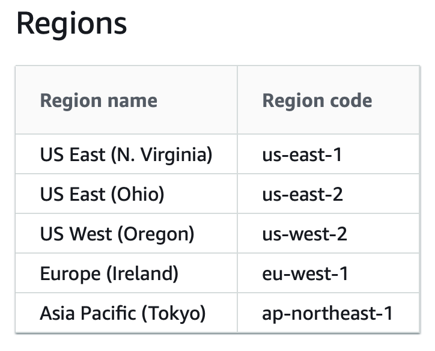
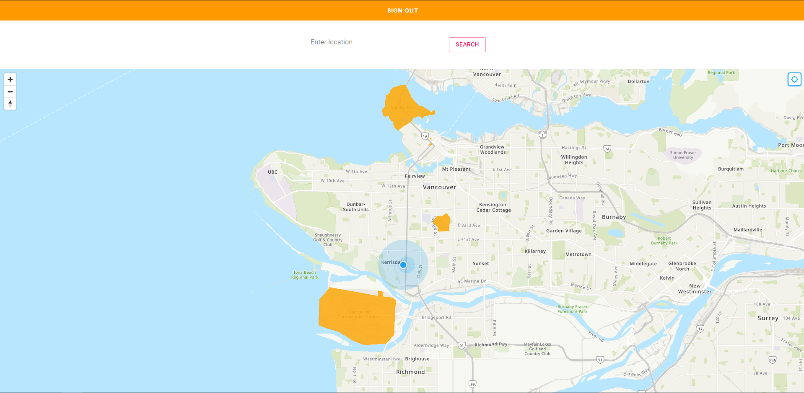

#  Amazon Location Services Template - React.js

For future CIC projects that requires maps, we can use this repository as a template.
This template uses Amazon Location Services to:
1. Create a map source
2. Geocoding/Reverse geocoding

###Pre-reqs
Location service is only available in the regions below (As of Feb 10, 2021).

Make sure your sso profile is using one those regions.


## How to use
1. Install dependencies using `npm install`
2. Log into aws and initiate this project as an Amplify project: `amplify init`
3. Add authentication to this project:
   ```
   amplify add auth
   ? Do you want to use the default authentication and security configuration? Default configuration
   ? How do you want users to be able to sign in? Username
   ? Do you want to configure advanced settings?  No, I am done.
   ```
   
4. To create map resource, follow the instructions [here](https://docs.aws.amazon.com/location/latest/developerguide/create-map-resource.html)
   - Take a note of the map name
5. To create a place index resource, follow the instructions [here](https://docs.aws.amazon.com/location/latest/developerguide/create-place-index-resource.html)
    - Take a note of the place index name

6. Go to [AWS Cognito Console](https://console.aws.amazon.com/cognito/home)
   1. Choose Manage Identity Pools
    2. Choose the identity pool that is being used for this amplify project
    3. Click edit identity pool in the top right corner
    4. Under "Unauthenticated identities", check "Enable access to unauthenticated identities" checkbox
    5. Take a note the name of the unauthenticated IAM role attached to this Identity Pool
    
7. Go to [AWS IAM Console](https://console.aws.amazon.com/iam/)
    1. Click Roles on the left panel
    2. Click onto the role name noted from step 6.5
    3. Now, we need to add 2 inline policies to this role, click on "Add inline policy".
       - Click onto the JSON tab
       - Copy and paste the code below (allows us to access the map resource)
   ```
    {
    "Version": "2012-10-17",
    "Statement": [
        {
            "Sid": "MapsReadOnly",
            "Effect": "Allow",
            "Action": [
                "geo:GetMapStyleDescriptor",
                "geo:GetMapGlyphs",
                "geo:GetMapSprites",
                "geo:GetMapTile"
            ],
            "Resource": "arn:aws:geo:REGION:ACCOUNTID:map/MAPNAME"
             }
        ]
   }
   ```
            Note the last line of the code above, replace the following with your own information.
            REGION: Region of the map resource
            ACCOUNTID: 12 digit ID associated with your account
            MAPNAME: from step 4.1
   - click on 'review policy', give it a name, then click create policy.
    5. Place index access policy
         - Repeat step 7.3, but this time, use the code below and on the last line, replace 
        PLACEINDEXNAME with the name in step 5.1
    ```
   {
    "Version": "2012-10-17",
    "Statement": [
        {
            "Sid": "PlacesReadOnly",
            "Effect": "Allow",
            "Action": [
                "geo:SearchPlaceIndex*"
            ],
            "Resource": "arn:aws:geo:REGION:ACCOUNTID:place-index/PLACEINDEXNAME"
            }
        ]
    }
   ```

8. Create a local env file for map name and place index name
    1. Under the root directory, create a file named .env
    2. Copy the code below and replace MAPNAME and PLACEINDEXNAME with the names you created (from step 4.1 and 5.1):
    ```
   REACT_APP_MAP_NAME=MAPNAME
   REACT_APP_PLACE_INDEX_NAME=PLACEINDEXNAME
   ```
   
9. `npm start` to run the application you should see a screen like this:
   


