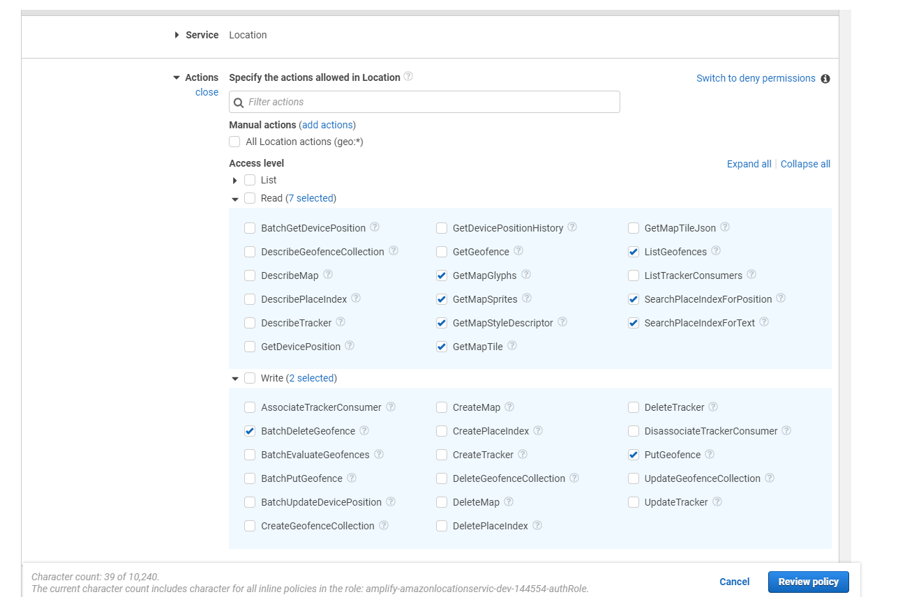
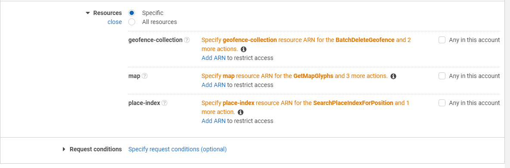
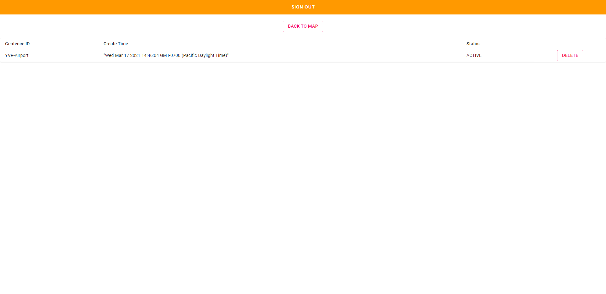

#  Amazon Location Services Template - React.js

For future CIC projects that requires maps, we can use this repository as a template.
This template uses Amazon Location Services to:
1. Create a map source
2. Geocoding/Reverse geocoding
3. Display geofence

### Pre-reqs
Warning: `mapbox-gl@^2` and `react-map-gl@^6` are NOT compatible with Amazon Location Service!

Location service is only available in the regions below (As of Feb 10, 2021).


Make sure your sso profile is using one those regions.


## Creating the resources required
1. Install dependencies using `npm install`
2. Log into aws and initiate this project as an Amplify project: `amplify init`
3. Add authentication to this project:
   ```
   amplify add auth
   ? Do you want to use the default authentication and security configuration? Default configuration
   ? How do you want users to be able to sign in? Username
   ? Do you want to configure advanced settings?  No, I am done.
   ```
   
4. Create map resource, follow the instructions [here](https://docs.aws.amazon.com/location/latest/developerguide/create-map-resource.html)
   - Take a note of the map name
5. Create a place index resource, follow the instructions [here](https://docs.aws.amazon.com/location/latest/developerguide/create-place-index-resource.html)
    - Take a note of the place index name
6. Create a geofence collection, follow the instructions [here](https://docs.aws.amazon.com/location/latest/developerguide/add-geofences.html)
   - Take a note of the geofence collection name

7. Go to [AWS Cognito Console](https://console.aws.amazon.com/cognito/home)
   1. Choose Manage Identity Pools
    2. Choose the identity pool that is being used for this amplify project
    3. Click edit identity pool in the top right corner
    4. Take a note the name of the Authenticated IAM role attached to this Identity Pool
    
8. Go to [AWS IAM Console](https://console.aws.amazon.com/iam/)
    1. Click roles on the left panel
    2. Click onto the authenticated role name noted from step 7.4
   3. Add the following inline policies with the resource ARN
      
      


9. Create a local env file for map name and place index name
    1. Under the root directory, create a file named .env
    2. Copy the code below and replace MAPNAME, PLACEINDEXNAME, GEOFENCECOLLECTIONNAME with the names you created (from step 4,5 and 6):
    ```
   REACT_APP_MAP_NAME=MAPNAME
   REACT_APP_PLACE_INDEX_NAME=PLACEINDEXNAME
   REACT_APP_GEOFENCE_COLLECTION=GEOFENCECOLLECTIONNAME
   ```
   
10. `npm start` to run the application you should see a screen like this:
    Create an account and log in to view the map
    
    
    
    


## How to use
- Type in address/location name on the search text field and click search
- To create a geofence, draw exactly 1 geofence using the draw tool on the top-right corner
- Enter a unique geofence name for it
- Click add geofence, you will see the geofence in the table and aws


